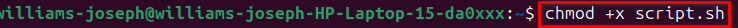

# Advanced Linux Commands
## File Permission Commands
File permissions in Linux control who can read, write, or execute a file. These permissions are crucial for system security and data privacy, allowing administrators to regulate access to files and directories.

### chmod command
---
`chmod` stands for *change mode* and is used to modify the permissions of files and directories. Permissions are divided into read (r), write (w), and execute (x). These can be assigned to three categories: User (owner), Group, and Others.

**How it works**
- Create an empty file and verify it's file permissions.

    

- Update the file permissions using `chmod`
    

- Check the updated permissions
    

**Practical Numerical Usecases**

Below is a usecase where numerical representation of permissions is used to change permissions of `script.sh` file.


From the screenshot above, `chmod` was used to add execute permission for user, group and others. 

````
chmod 755 script.sh
````


This allows the `user` to read, write and execute while `group` and `others` can only read and execute.

---
This is another usecase where only `user` has all permissions on `note.txt` file. We have to allow group members and others all permissions using numeric represenation.

- Create `note.txt` file with only user having all permissions

    

- Check permissions for `note.txt`

    

- Allow group members and others full permissions using numeric representation.

    

### chown command
---
`chown` stands for *change owner* and is used to change the owner or group associated with a file or directory. Ownership is important because it determines who can change the file permissions and who has access to the file.

**Exploring the use of `chown`**

To explore the usecase of `chown`, a server was simulated, this server has a group called `developers` with another user called `John`. The owner of a file on the server named `filename.txt` will be changed and to ensure any user in the `developer` group has ownership of the file. 

**Create A New User**
```
sudo adduser johndoe
```


**Grant User Admin Privileges**
```
sudo usermod -aG sudo johndoe
```


**Switch to new user**
```
su johndoe
```


**Modify user account *(change user password)***
```
sudo passwd johndoe
```


**Switch between users**
```
su johdoe
su williams-joseph
```


**Create and Verify group**

```
sudo groupadd developers
```

```
sudo grep developers /etc/group
```


**Add new user to group and verify membership**
```
sudo usermod -aG developers johndoe
```

```
id johndoe
```


**Delete the User**
```
sudo userdel -r johndoe
```


**Change group ownership of directory**
```
sudo chown :developers ~/Documents_backup
```


**Change group permission of a directory**
```
sudo chmod g+rw ~/Documents_backup
```


## Side Task
- **Create `devops` group on the server**
    ```
    sudo groupadd devops
    ```

    ```
    sudo grep devops /etc/group
    ```

    
 
- **Create 5 Users**

    

    

- **Create folder for each user**

    ```
    sudo mkdir /home/mary
    sudo mkdir /home/mohammed
    sudo mkdir /home/ravi
    sudo mkdir /home/tunji
    sudo mkdir /home/sofia
    ```
    *Note: The folders were already created automatically while user was added.*

    


- **Ensuring and verifying ownership of created groups belongs to `devops`**

    ```
    sudo chown :devops /home/mary
    sudo chown :devops /home/mohammed
    sudo chown :devops /home/ravi
    sudo chown :devops /home/tunji
    sudo chown :devops /home/sofia
    ```

    

    ```
    ls -la /home/ | grep -E "(mary|mohammed|ravi|tunji|sofia)"
    ```
    

## Conclusion
This guide covered essential Linux commands for managing file permissions and user ownership. We learned how to use chmod to control who can read, write, and execute files, and chown to change file ownership between users and groups.
The practical exercise of creating a devops group with 5 users demonstrates real-world system administration tasks. Key skills covered include:

- Creating users and groups
- Setting up home directories
- Managing group ownership with chown
- Verifying permissions with `ls` - `la`

These commands are fundamental for Linux system administration and creating secure, collaborative work environments.


